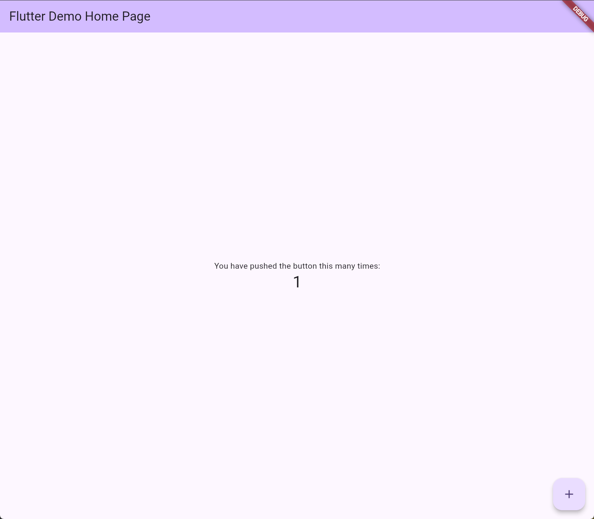
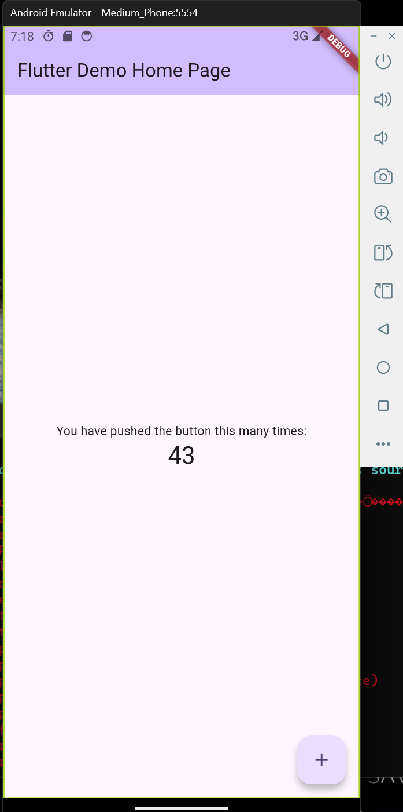

# hello\_world

我的第一个 Flutter 应用，基于 Flutter 3.47.4 stable，支持 Web 与 Android 双端运行。

## 环境要求

- Flutter 3.47.4 (stable) / Dart 3.13.3
- Android SDK 34（Android 模拟器）
- Chrome（Web 端）

环境检查：

```bash
flutter doctor
```

!\[flutter doctor 全绿]\(docs/flutter\_doctor.png)

## 运行方式

```bash
flutter pub get          # 拉取依赖
flutter devices           # 查看可用设备
flutter run -d chrome     # Web 端
flutter run -d emulator-5554   # Android 模拟器（设备 ID 以 flutter devices 为准）
```

```
flutter pub get          # 拉取依赖
flutter devices           # 查看可用设备
flutter run -d chrome     # Web 端
flutter run -d emulator-5554   # Android 模拟器（设备 ID 以 flutter devices 为准）
```

## 运行截图

**Web 端（Chrome）：**



**Android 模拟器：**



## 目录说明

- `lib/main.dart`：应用入口，`main()` 中通过 `runApp()` 挂载根 Widget
- `pubspec.yaml`：依赖与资源声明
- `android/`、`web/` 等：各平台工程

